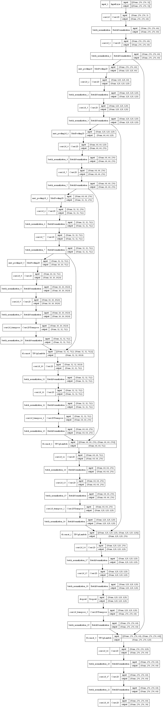

## Brief Comment on UNet

At the beginning, our group used the UNet network to construct a model for image segmentation. unet acquires features of the image information during downsampling, while the downsampled information is integrated during upsampling by skip connenction. During upsampling, the model is able to combine information from all levels. Our model structure is as follows:

During training the model, we also found problems and several ways that can help improve the performance of our model.

1. Due to hardware limitations, we are limited in the number of epochs we can train, if we can train more epochs, the accuracy of the model should be improved.
2. In our model, batch size is set to 32. It could be helpful if we select an appropriate larger number.
3. We could probably change the loss function. (The loss function we choose is cross entropy.

